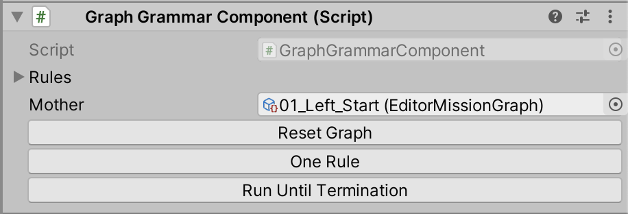
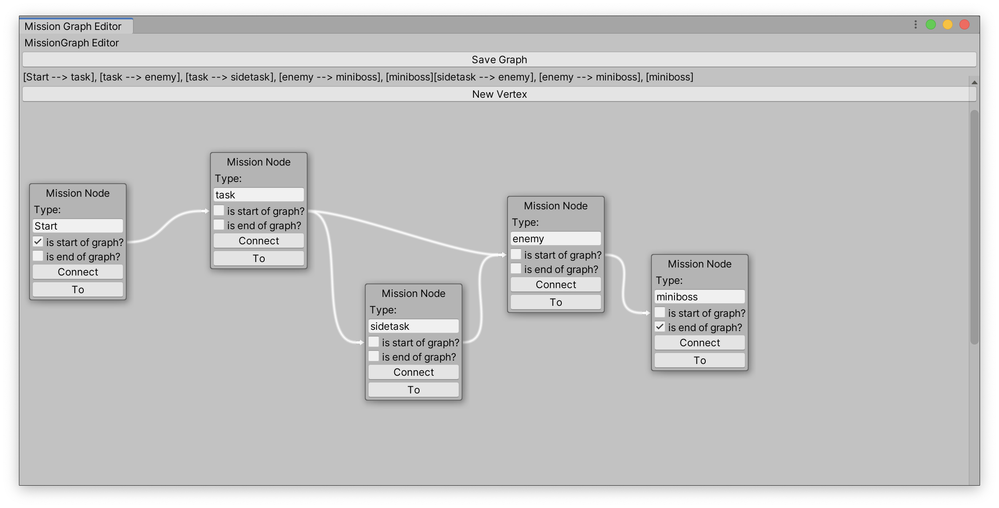
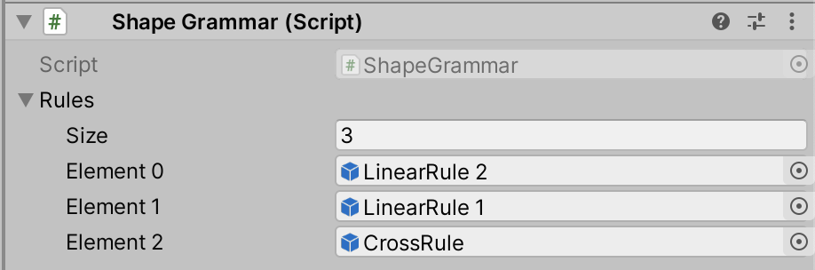
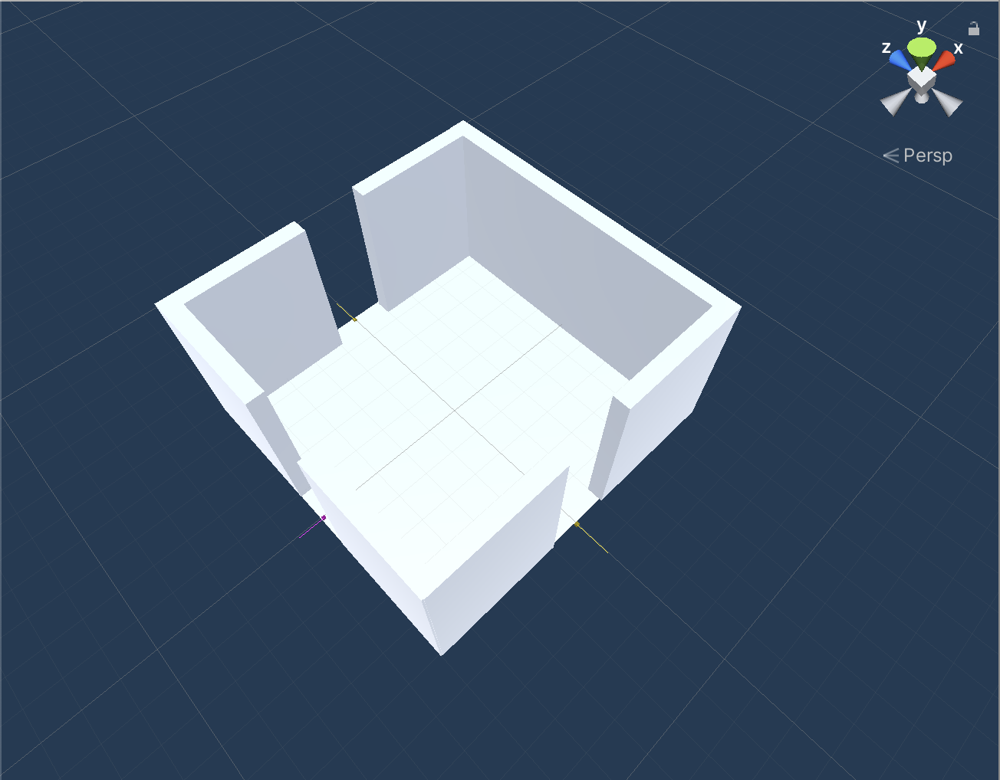

# Grammar Manual - Organica Wild

## General Concept

Organica Wild implements a graph and a shape grammar.
The graph grammar can generate a mission graph for a level by substituting subtrees with other subtrees.
The shape grammar can transform a mission graph into a 3D level by placing special prefabs (generally rooms) for each mission graph node.
The grammars are implemented with the concepts of [Joris Dormans](https://dl.acm.org/doi/10.1145/1814256.1814257) as a guideline.
For more ideas on how to use it, we strongly recommend to read his work.

### How to make your own mission graphs

Add the graph grammar component to a Unity GameObject.

In the graph grammar component you can define rules and a mother.
The rules define how the graph is being manipulated. 
The mother is starting graph.
A rule consists out of two graphs. A left hand side and a right hand side. In application of the rule the left hand side is being replaced by the right hand side in the mother graph.

Create single graphs for the rules or as mother with the Menu entry in the top bar Organica Wild > Create > Mission Graph.
This opens a mission graph editor to create the graph structures in a node based editor.

Now simply drag the created assets onto the component to make your graph grammar complete.

### How to use the shape grammar

To use the shape grammar and convert a mission graph to a 3D level. Also add a Shape Grammar Component to the previous GameObject that already has the Graph Grammar Component.
A Shape Grammar also needs rules, however the rules have mission graph node types on the left side and a prefab on the right.
You can use any prefab, that you attach a Shape Grammar Rule Component onto.
The shape grammar rule component must then be equipped, with what types of mission graph nodes it should replace and where other nodes are attached to it.
The first you do directly inside of the Component.
The second are ScriptableConnections. 
You can edit these in the inspector while having the prefab open to see your changes in the debug view.

