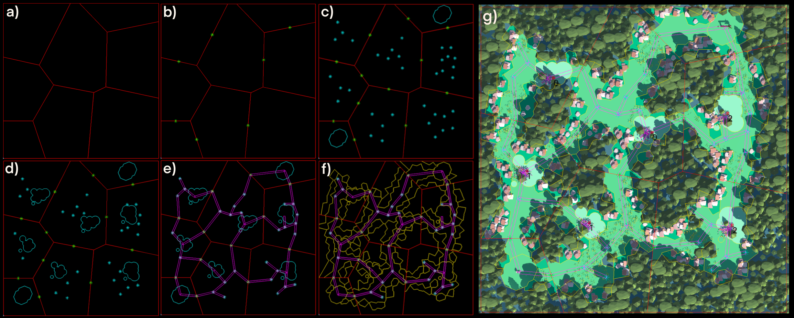

# Pipeline Manual - Organica Wild

### General Concept

Most Games that use PCG combine different techniques to generate something. For example No Man's Sky uses different
layered noise patterns combined with something similiar to marching cubes to generate the alien landscape. Our pipeline
allows you to do exactly such combinations of PCG in an elegant way inside of Unity.

It does this by abstract all different techniques to a common data structure. The data structure is a tree like
structure with geometric objects as nodes.
Each node is an `IGameWorldObject` inside the Code.
Every `IGameWorldObject` has an `IGeometry` as a Shape, by which it is represented inside the tree structure.

Each pipeline step manipulates the data structure in some defined way.

### An example



The image shows an example pipeline that creates the Game World from image g) in six steps.

a) Subdivides the game world into smaller polygons with a voronoi diagram and pds sampling. b) Defines connections
between some areas. c) Adds landmarks to each area d) Transform a single in each area to create same shaped pairs. e)
Adds paths between all landmarks with a minimum spanning tree and some random connections. f) Defines the shape of the
path with a cellular automata that uses voronoi cells instead of rectangular cells. g) Instantiate each object in the 2D
world via recipe (more on that later)

You can see how several unrelated techniques could be combined, if the result of each technique is reduced to a
geometric result.

This pipeline can be found inside the Samples and is a good start to getting to know the framework.

### Create your own Pipeline

To create your own generator you need to do two things.

1. define your pipeline steps (or choose some implemented ones)
2. define your instantiation recipes (or choose some implemented ones)

#### Custom pipeline steps

A Pipeline steps looks something like this in code.:

```c#
    //create a class and extend the pipelinestep abstract class
    public class MyPipelineStep : PipelineStep
    {
        ...
        
        // write your code to manipulate the game world in here. 
        public override GameWorld Apply(GameWorld world)
        {
            //manipulate the world with the definined API's 
            //on IGameWorldObject and IGeometry. 
            //Your Imagination is the limit
            world.Root.AddChild(new Area(...)));
            
            ...
            //return the manipulated world
            return world;
        }
    }
```

#### Custom Recipes

A recipe defines how a geometric entity inside of the pipeline is going to be instantiated after all pipeline steps have been run.
So a Recipe takes in an `IGameWorldObject` and generates a Unity `GameObject` as a result.

There are a few pre implemented recipes available, however for more specific instantiations you may need to make your own.
Inside of the recipe you can do what you want, just keep in mind, that a recipe will later be executed inside a coroutine.

A simple recipe may look like this.:

```c#
 //Simple extend the abstract class GameWorldObjectRecipe
 public class MyAmazingRecipe :  GameWorldObjectRecipe
 {
        
        //transforms an IGameWorldObject to a GameObject
        public override GameObject Cook(IGameWorldObject individual)
        {
            GameObject result = new MeshFromPolygon(indivdual.Shape as OwPolygon));
            return result;
        }
    }
```

### Run your steps and recipes

Create a new GameObject in the scene view and add the `StandardPipelineManager` and `StandardThemeApplicator` as script to the gameobject.
As well as all of your custom implemented `PipelineStep` in the order that they should be executed in.

The `StandardPipelineManager` will give you errors if certain steps are not allowed to be executed in certain order.
The standard implemented steps all give certain guarantees and require guarantees from the previous step.
A guarantee a step provides are attributes on the pipelinestep implementation class.

It is easier to understand in Code. Taken the example above added guarantees may look like this.

```c#
    //this pipeline step guarantees that sub areas are placed
    [SubAreasPlacedGuarantee]
    public class MyPipelineStep : PipelineStep
    {
        //this step requires that areas have been placed in the step prior
        public override Type[] RequiredGuarantees => new Type[] {typeof(AreasPlacedGuarantee)};
        
        public override GameWorld Apply(GameWorld world)
        {
            world.Root.AddChild(new Area(...)));
            ...
            return world;
        }
    }
```

Once all steps are added to the same GameObject in the Scene view, you can parametrise your steps and the add recipes in the configuration of the `StandardThemeApplicator`. 
Run the pipeline via the provided buttons or any external script.
The `StandardPipelineManager` provides public functions for starting the pipeline, so you can start the generation from your GameManager.