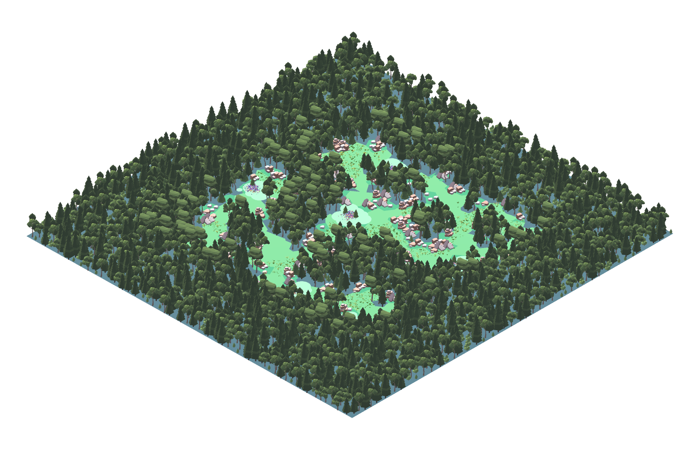

# Organica Wild

A fully open PCG (procedural content generation) framework for Unity to create organic and natural looking worlds.



---

## Features

### PCG Pipeline Framework

Combine PCG Techniques in a defined interface to create stunning generators for your games. 
Instruction are in the [Pipeline Manual](Framework/Pipeline).


### Shape and Graph Grammars

Combine Mission graph grammar and shape grammar to create playable dungeon layouts.
Instructions are in [Grammar Manual](Framework/GraphGrammar).


### Search based approach

Use a pre implemented genetic algorithm (NSGA-II) with a well defined interface to search for the best solution when generating your game assets. 
Instructions are in [Search based Manual](Framework/Evolutionary).


### Perlin Noise

Profit from an improved perlin noise implementation with layered scaled noise to create more interesting patterns.
Instructions are in [Perlin Noise Manual](Framework/Perlin%20Noise).


### Cellular Automata

Use Cellular Automata to generate things like caves and much more.
Instructions are in [Cellular Automata Manual](Framework/Cellular%20Automata).


### Poisson Disk Sampling

Generate points with a minimum distance. A technique often used in rendering, can produce beautiful arrangements of objects in a scene.
Instructions are in [Poisson Disk Sampling Manual](Framework/Poisson%20Disk%20Sampling).

---

## [Install](#install)  

### Use in a project

Organica Wild is a Unity Package. To use it add it add it via the [Unity Package Manager](https://docs.unity3d.com/Manual/upm-ui-giturl.html).
Import the samples from the Unity Package Manager to get started.

## Contribute

If you wish to contribute or develop your own extensions to the framework to this project please follow the contributing guidelines and setup the project as follows.

#### Setup

If you wish to change the core framework code you must add the package outside of the unity package manager. Since it only adds a read only copy of the package.
To have an editable version of the project on your device proceed as described.:

Create an empty project.

Move to the projects Packages folder. Clone the project into the Packages/ folder of the Unity Project

```
cd <project folder>/Packages
```

Clone the repo into its own folder inside of the Packages folder.

```
git clone https://github.com/OrganicaWild/OrganicaWild.git
```

Wait for the clone and Unity upon opening the project unity will import the code as if you added the package via package manager.
Viola, you have a editable copy of the code.

Make your changes and commit.
To have your changes in the main repo, create a pull request.


### Contribute in the samples

If you wish to contribute to the samples and provide the improved samples to the community then follow along here.
The Samples~ folder is not visible inside of unity, because it ends with a Tilde.

---
**NOTE**

This is only needed if you wish to change the samples and push the changes to the Organica Wild repository. If you want to use the samples in your own project and develop on top them, follow along like [Install](#install)

---

You can edit it normally outside of Unity. To verify your changes however, you may want to use the code inside of Unity.
The easiest is to rename the folder before developing. 

You can do this in your file explorer or in the terminal.

In terminal, navigate to package folder.
```
cd <project folder>/Packages/OrganicaWild
```
Rename folder to any name without a ~ at the end for it to appear inside of Unity.
```
mv Samples~ Samples
```
Before commiting change the folder name back.
```
mv Samples Samples~
```

Viola, now you can change the samples and provide 